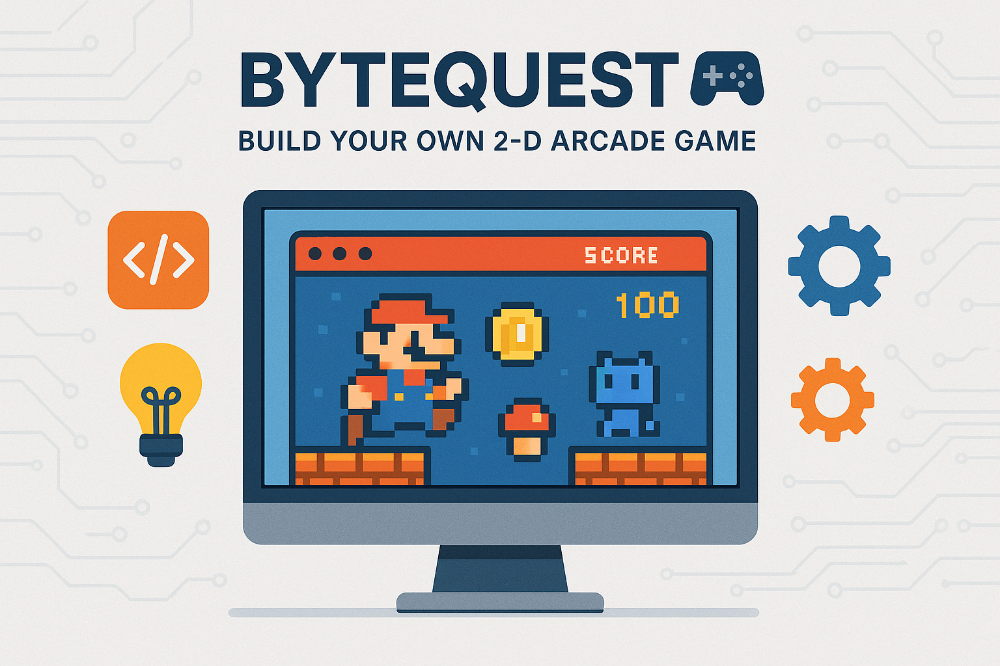

# ByteQuest 🎮 – Build Your Own 2-D Arcade Game

## 📋 Overview
Welcome to your very first “from-scratch” game project! Over the next week you will design and implement **ByteQuest**, an old-school 2-D arcade game in which a plucky avatar collects points while dodging marauding bugs in computer-lab mazes. You’ll steer the player with the keyboard, keep score, spawn enemies with distinct personalities, and switch smoothly between menus, play, pause, and game-over screens.

Along the way you’ll practice three core skills:
1. Reading configuration files to **instantiate** game objects on the fly.  
2. **Designing clean, reusable classes** for everything from players to particles.  
3. **Programming creatively**—choosing art, sounds, rule tweaks, and overall vibe that make your game uniquely yours!

By the end you’ll deliver a playable `.jar` file and a short reflection describing the design decisions you made.

## 🎯 Learning Objectives
- Using data from files to instantiate game objects dynamically.
- Designing cohesive, maintainable class hierarchies that follow OOP best practices.
- Exercising creative freedom to extend, polish, and personalise a software project.

## 📚 Prerequisites
- Java fundamentals (variables, loops, arrays, exceptions).
- Basic OOP (classes, inheritance, interfaces).
- Elementary file I/O with `java.nio` or `java.io`.
- IDE of choice (IntelliJ / VS Code / Eclipse) and Java 17+.
- Optional familiarity with Java Swing or JavaFX (scaffolding provided).

## 🚀 Getting Started
1. Read the **Background / Story** (below) to spark inspiration.  
2. Clone the starter repository provided by your TA.  
3. Ensure Java 17+ is on your PATH and you can run `java -version`.  
4. Import the project into your IDE and run the empty `Game` class to verify the window opens.  

### Background / Story 📚
The university’s central computer has been infected by mischievous NullPointer gremlins. You, a tiny byte named **Bit**, must dive into the circuitry, gather “knowledge tokens,” and purge the gremlins before they crash the mid-term grading server. Each level is loaded from a text file describing where walls, enemies, power-ups, and the exit portal appear. As you advance, stronger gremlins emerge—some chase you directly, others patrol in patterns. Keep your wits (and your hit-points) intact!

### Technical Requirements 🔧
(Shortened list—see detailed requirements inside Exercise 1)  
• Player movement & controls  
• Scoring system  
• Enemy interactions & behaviour  
• Game-state management  
• Collision detection  
• File-driven object instantiation  
• Well-designed classes  
• One creative twist

### One-Week Road-Map 🗓️
Day 1 Idea sketching & class diagram  
Day 2 Core class scaffolding  
Day 3 File parsing & object instantiation  
Day 4 Movement & collision  
Day 5 Enemy AI & game states  
Day 6 Polish & creative feature  
Day 7 Testing, reflection, packaging

---

## Exercises

### Exercise 1: Files Come Alive! 🌱  
⏱️ Estimated Time: 45–60 minutes  

🎯 Goal: Understand why and how to load level data from external files, and explore potential pitfalls.  

📝 Instructions:  
1. Read the provided explanation and the sample `level1.txt` snippet.  
2. Answer the guiding questions (1–4) in a document named `exercise1.md`.  
3. Compare plain-text versus JSON level formats in terms of readability, parsing difficulty, and maintainability.  

💡 Hints:

Click for hint

• Consider libraries such as Gson for JSON.  
• Think about `NumberFormatException`, `ArrayIndexOutOfBoundsException`, or missing asset files.  
• Validation layers could include checksums, schema files, or in-game editors with live preview.

✅ Success Criteria:
- [ ] All guiding questions are answered thoughtfully.  
- [ ] Comparison between file formats references at least three concrete trade-offs.  

---

### Exercise 2: Class Blueprints & Data Pipelines 🏗️  
⏱️ Estimated Time: 60–75 minutes  

🎯 Goal: Produce a concise design proposal for the `LevelLoader` and supporting classes.  

📝 Instructions:  
1. Draft a 1–2 page design document that includes:  
   • ASCII/UML class diagram.  
   • Public method list for each class.  
   • 2–3 sentence rationale per class explaining how it follows the Single-Responsibility Principle.  
2. Include a 10–15 line pseudocode sketch of the game-start sequence.  
3. Submit as `level_loader_design.pdf` or `.md`.  

💡 Hints:

Click for hint

• Keep parsing separate from game-state management.  
• Factory helpers reduce `switch` bloat.  
• Remember to close streams or use try-with-resources.

✅ Success Criteria:
- [ ] Diagram shows relationships for `Game`, `LevelLoader`, `GameObject` hierarchy.  
- [ ] All classes list clear public APIs.  
- [ ] Rationale references SRP and at least one other OOP principle.  

---

### Exercise 3: From Lines to Live Objects 🔄  
⏱️ Estimated Time: 60–90 minutes  

🎯 Goal: Implement `LevelLoader.load()` so it reads a level file, validates syntax, and returns an `ArrayList<GameObject>`.  

📝 Instructions:  
1. Open `src/com/bytequest/io/LevelLoader.java` and complete TODOs 1-6.  
2. Use the supplied test files (`minimal.txt`, `patrol.txt`) to verify behaviour.  
3. Run (or write) JUnit tests to assert correct object counts and properties.  

💡 Hints:

Click for hint

• Skip empty or comment lines beginning with `#`.  
• Use `String.split("\\s+")` for tokenisation.  
• Delegate creation logic to an `EntityFactory` stub (added next exercise).

✅ Success Criteria:
- [ ] `load()` returns correct objects for provided test levels.  
- [ ] Malformed lines log warnings but do **not** crash the game.  
- [ ] No resource leaks—streams closed via try-with-resources.  

---

### Exercise 4: Smart Factories & Flexible Enemies 🤖  
⏱️ Estimated Time: 90–120 minutes  

🎯 Goal: Refactor parsing logic into an `EntityFactory` and add pluggable movement strategies for enemies.  

📝 Instructions:  
1. Implement `EntityFactory` with a registry mapping keywords → lambda constructors.  
2. Move all object-creation code from `LevelLoader` to the factory.  
3. Create `MovementStrategy` interface plus `DirectChaseStrategy` and `PatrolStrategy` implementations.  
4. Verify that adding a new enemy type requires zero changes in `LevelLoader`.  

💡 Hints:

Click for hint

• `Map<String, Function<String[], GameObject>>` keeps look-ups O(1).  
• Annotations + reflection can auto-register classes (optional stretch).  
• Benchmark loading 100 levels to stay under 200 ms total.

✅ Success Criteria:
- [ ] `LevelLoader` contains no `switch`/`if` ladders for entity types.  
- [ ] Enemies delegate movement to a `MovementStrategy`.  
- [ ] Performance target (<200 ms for 100 small levels) met on typical laptop.  

---

### Exercise 5: Save My Quest! 💾  
⏱️ Estimated Time: 4–6 hours (split over two days)  

🎯 Goal: Build a persistence layer that saves and reloads game progress and high scores.  

📝 Instructions:  
1. Design data-model classes (`SaveGame`, `EnemySnapshot`, `HighScoreEntry`).  
2. Implement `SaveIO` interface with `JsonSaveIO` and `BinarySaveIO` concrete classes.  
3. Wire quick-save (F5) and slot selection on game start.  
4. Handle corrupted files, version mismatches, and disk-full errors gracefully.  
5. Document design decisions (½-page) and include round-trip unit tests.  

💡 Hints:

Click for hint

• Keep heavy I/O off the rendering thread – use `CompletableFuture` or an executor.  
• Embed a `schemaVersion` field for forward compatibility.  
• For atomic saves: write to temp file then `Files.move` with `ATOMIC_MOVE`.

✅ Success Criteria:
- [ ] Quick-save and reload work without losing state.  
- [ ] Corrupted files trigger Safe Mode rather than crashing.  
- [ ] Round-trip tests pass for both JSON and binary formats.  

---

### Exercise 6: Show Your Style! 🌟  
⏱️ Estimated Time: 4–6 hours  

🎯 Goal: Add a substantial creative extension (choose ONE path or propose your own).  

📝 Instructions:  
Pick **one** path and implement all bullet points:  
A. Procedural Labyrinth Generator 🌀  
B. Particle & Visual FX System ✨  
C. Accessibility & UX Upgrade ♿️  

Finish with:  
• Javadoc for every new public class/method.  
• ½–1 page reflection answering the four provided questions.  

💡 Hints:

Click for hint

• For procedural mazes, recursive backtracking is quick to code.  
• Particles can be batched to reduce draw calls.  
• Accessibility: Java’s `java.awt.Toolkit` offers basic TTS hooks.

✅ Success Criteria:
- [ ] Extension compiles and integrates with the main game.  
- [ ] ≥90 % new public methods documented with Javadoc.  
- [ ] Reflection document submitted and addresses all questions.  

---

## 🤔 Reflection Questions
Answer these in `reflection.md` after you finish all exercises:  
1. Which creative extension did you choose and why?  
2. What was the most challenging bug you encountered, and how did you resolve it?  
3. How did your class design evolve from Exercise 2 to the final product?  
4. In hindsight, which design decision would you change with an extra week, and why?  

Good luck, have fun, and remember: the best code is the code you enjoy writing! 🎉