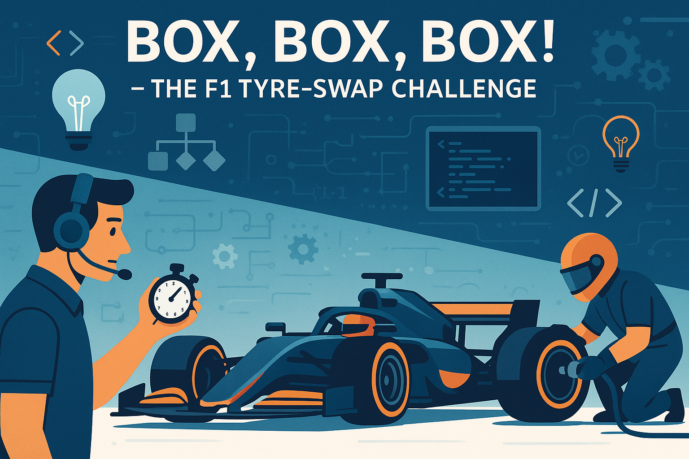

# 🏎️ “Box, Box, Box!” – The F1 Tyre-Swap Challenge  
*(Week 1 – Complete, Polished Edition)*

---

## 📋 Overview
You are the lead software engineer for a brand-new Formula One strategy simulator. Your mission: help the driver decide the perfect moment to pit (“box”) for new tyres before the current set overheats and spectacularly explodes on track! ⚡️💥

Across several weeks you will build a mini-game that  
• loads real-looking tyre-wear data from files,  
• models race-car behaviour through well-designed classes, and  
• presents the player with tense, lap-by-lap decisions.

This first week focuses on understanding the problem space, designing a clean object-oriented model, and wiring up the first pieces of file I/O. Ready to out-strategise the competition? Lights out and away we go! 🚦

> 🏁 Fun fact: A modern F1 pit stop can take **under 2 seconds**—that’s faster than it took you to read this sentence!

---

## 🎯 Learning Objectives
By the end of the week you will be able to:  
1. Parse structured text files and map each line to object attributes. (Using Data from Files to Instantiate Objects)  
2. Design cohesive Java classes with clear responsibilities, fields, and methods. (Designing Classes)  
3. Apply creative thinking to model unpredictable race scenarios and user decisions. (Programming Creatively)  

Keep these in mind—every exercise explicitly targets at least one of them.

---

## 📚 Prerequisites
• Basic Java syntax, methods, and object instantiation  
• Familiarity with arrays or `ArrayList`  
• JDK 17+, a plain-text editor or IDE (IntelliJ, VS Code, etc.), Git (optional but recommended)

---

## 🚀 Getting Started
1. Create a new Java project named `F1TyreSwap`.  
2. Inside `src/`, add three empty packages: `model`, `io`, `controller`.  
3. Download starter resources from the LMS:  
   • `sample_data/tyre_wear_soft.txt` – CSV-style tyre telemetry  
   • `uml_templates/blank_diagram.puml` – PlantUML scaffold  
4. **No coding yet!** Work through the conceptual and design exercises first. Think before you type. ☕

Cross-reference tip: output from Exercise 1 feeds directly into the UML work in Exercise 2, which in turn drives the code you will write in Exercise 3 and beyond.

---

## Exercises

### Exercise 1: Reading the Track 🏁 (📖 Conceptual Understanding)
Targets objective 1.  
*(Estimated 30–45 min)*  
… *(unchanged content from user message)* …

---

### Exercise 2: Drafting the Pit Wall 🛠️ (🔍 Design & Analysis)
Targets objectives 1 & 2.  
*(Estimated 30–45 min)*  
… *(unchanged content)* …

> Transition ➡️ Exercise 3 implements the classes you have just drawn. Keep your UML diagram open while coding so you can cross-check method names and relationships.

---

### Exercise 3: Loading the Telemetry 📡 (🏗️ Building Foundations)
Targets objectives 1 & 2.  
*(Estimated 45–60 min)*  
… *(unchanged content)* …

When finished, you will have a fully initialised `Tyre` object populated from file data—critical input for Exercise 4.

---

### Exercise 4: Heat & Wear Dynamics 🔥 (🔄 Integration & Enhancement)
Targets objectives 1 & 2.  
*(Estimated 45–60 min)*  
… *(unchanged content)* …

Notice how `Car.isTyreAtRisk()` now calls `Tyre.getDegradation(...)`, showcasing clean separation of concerns designed in Exercise 2.

---

### Exercise 5: The Strategy Engine 🤯 (🚀 Advanced Implementation)
Targets objectives 2 & 3.  
*(Estimated 60–90 min)*  
… *(unchanged content)* …

Cross-reference: Re-use `ConsoleDecisionProvider` later if you pick Path B in Exercise 6.

---

### Exercise 6: Weather Wizardry ⛅️ (🌟 Creative Extension)
Targets objective 3 (plus 1 & 2 if you integrate deeply).  
*(Estimated 60–90 min)*  
… *(unchanged content)* …

---

## 🤔 Reflection Questions
*(unchanged content)*

---

## ✅ Final Checklist
Before you submit, tick off every item:

- [ ] Exercise 1: Column names, units, and two data-validation strategies documented.  
- [ ] Exercise 2: UML diagram (≥ 3 classes + 1 interface) committed; design-rationale paragraph written.  
- [ ] Exercise 3:  
  • `LapData` compiles with correct fields & `toString()`  
  • `IOManager.loadLapData()` accurately loads all non-header lines  
  • Invalid rows handled gracefully  
- [ ] Exercise 4:  
  • `Tyre` implements `Wearable` and caps degradation at 100 %  
  • `Car.isTyreAtRisk()` returns `true` when degradation > 70 %  
  • DemoRace prints 10 laps without errors  
- [ ] Exercise 5:  
  • Strategy loop asks for pit decisions and logs to `logs/`  
  • Tyre explosion at degradation > 95 % works exactly once  
  • Different compounds alter degradation rates  
- [ ] Exercise 6: One path (Weather **OR** GUI) fully integrated and documented; at least one JUnit 5 test passes.  
- [ ] All public methods have Javadoc; code compiles under `javac --release 17`.  
- [ ] README lists build/run commands and any third-party libraries (none required is fine).  
- [ ] Project structure matches `model`, `io`, `controller`; no package-cycle warnings.  
- [ ] Git repository pushed / ZIP archived; commit messages are informative (≤ 20 lines each).  

---

## 📚 Additional Resources
1. Official Java Tutorials – *Essential IO* section  
   https://docs.oracle.com/javase/tutorial/essential/io/  
2. PlantUML Cheat Sheet – quick reference for class diagrams  
   https://plantuml.com/cheat-sheet  
3. “Clean Code” Chapter 5: *Formatting* – guidance on readable method and class layouts (optional but inspiring)

---

## 🤝 Collaboration Guidelines
• Discuss concepts and high-level design with classmates freely—real F1 teams debrief together!  
• **Do NOT** share or copy complete source files, unit tests, or solutions. All code you submit must be your own work.  
• Credit any external inspiration in code comments or README (e.g., “formula adapted from 2023 FIA technical brief”).  
• Pair-programming allowed for brainstorming **only**; each student must implement and commit their own version.  
• Use campus forums or Git issues for help; never post full answers.  
• Suspected plagiarism will be handled under university policy.

---

Good luck, engineer! May your tyres stay within the optimal temperature window and your strategy calls be legendary. 🏁